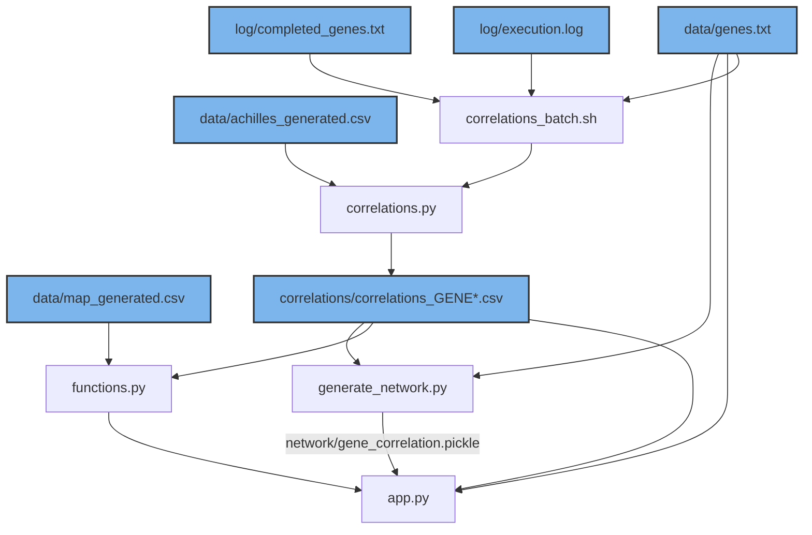

# GeneInteractionApp

```mermaid
graph TD;
    genes[data/genes.txt]
    log1[log/execution.log]
    achilles[data/achilles_generated.csv]
    mapa[data/map_generated.csv]
    log2[log/completed_genes.txt]
    corrsFiles[correlations/correlations_GENE*.csv]
    corrPy[correlations.py]
    corrSh[correlations_batch.sh]
    function[functions.py]
    net[generate_network.py]
    app[app.py]

    style genes fill:#7cb5ec,stroke:#333,stroke-width:2px;
    style log1 fill:#7cb5ec,stroke:#333,stroke-width:2px;
    style achilles fill:#7cb5ec,stroke:#333,stroke-width:2px;
    style mapa fill:#7cb5ec,stroke:#333,stroke-width:2px;
    style log2 fill:#7cb5ec,stroke:#333,stroke-width:2px;
    style corrsFiles fill:#7cb5ec,stroke:#333,stroke-width:2px;

    genes-->corrSh
    log1-->corrSh
    log2-->corrSh
    achilles-->corrPy
    mapa-->function
    corrSh-->corrPy
    corrPy-->corrsFiles
    corrsFiles-->app
    genes-->app
    corrsFiles-->function
    function-->app
    genes-->net
    net-- network/gene_correlation.pickle -->app
    corrsFiles-->net

```
