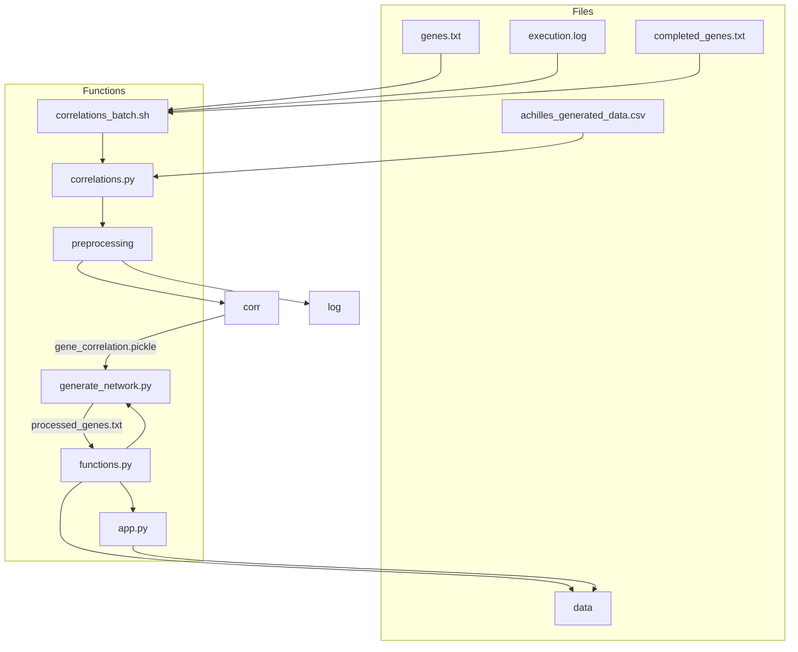

# GeneInteractionApp

```mermaid
graph TD;
    genes[genes.txt]
    log1[execution.log]
    log2[completed_genes.txt]
    achilles[achilles_generated_data.csv]
    preprocess[preprocessing]
    corrPy[correlations.py]
    corrSh[correlations_batch.sh]
    data[data]
    function[functions.py]
    net[generate_network.py]
    app[app.py]

    subgraph Files
    genes
    log1
    log2
    achilles
    data
    end

    subgraph Functions
    corrPy
    corrSh
    preprocess
    function
    net
    app
    end

    genes-->corrSh
    log1-->corrSh
    log2-->corrSh
    achilles-->corrPy
    corrSh-->corrPy
    corrPy-->preprocess
    preprocess-->corr
    preprocess-->log
    corr-- gene_correlation.pickle -->
    net-- processed_genes.txt -->
    function-->app
    function-->net
    function-->data
    app-->data


```
