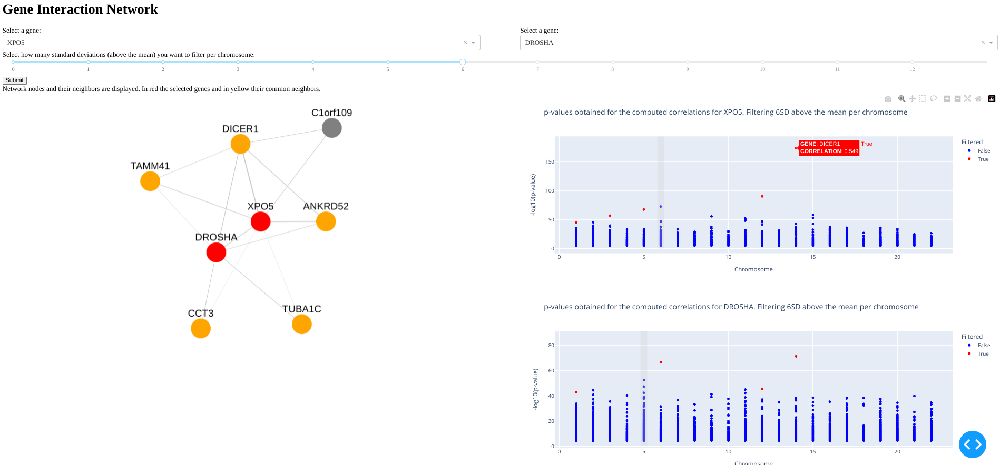
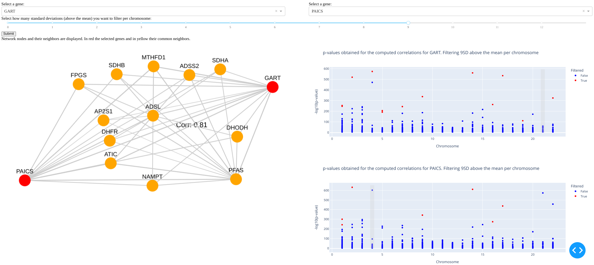

# GeneInteractionApp
-- IN PROGRESS --
The Gene Interaction App is an interactive tool designed to explore genetic interactions post CRISPR-Cas9 knockout, allowing users to investigate how the absence of specific genes affects other genes within cancer cell lines. Based on the DepMap project, this application enables users to select and analyze two genes, observing the correlations between these genes and identifying shared correlations post-gene knockout.

## Usage
1. **Clone the Repository:**
    ```bash
    git clone https://github.com/ntmaseras/GeneInteractionApp.git
    ```

2. **Run the Application:**
    - For testing, only some genes available.
    - Install necessary dependencies (provided environment.yml). 
   ```bash
    conda env create -f environment.yml
    ```
    - Execute the main application file `app.py`. 
    ```bash
     python3 app.py
    ```


3. **Examples**
   
   3.1 DROSHA-DICER1
   
   
   3.2 GART-PPAT
   
## Acknowledgements

The Gene Interaction App acknowledges the following projects, resources, and individuals for their contributions:

- **DepMap Project:** Acknowledgment to the DepMap project for providing the essential datasets and resources for correlation analysis.
- **Contributors:**

