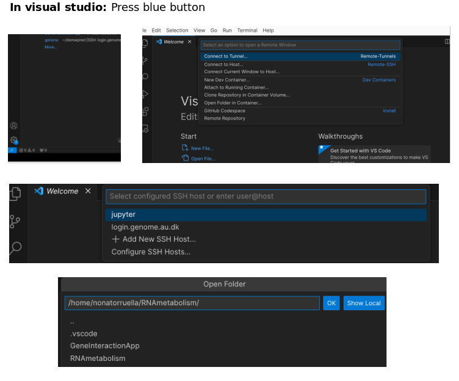

## Running the App in the Cluster

Follow these steps to run the app in a GenomeDK environment:

```
conda create --name rnametabolism pandas networkx dash-bio dash_cytoscape matplotlib -c bioconda
conda install networkx
   conda config --show channels
   conda config --add channels conda-forge
   conda config --add channels bioconda


1. **Navigate to the App Directory:**

   ```bash
   cd RNAmetabolism/GeneInteractionApp/

2. **Start an Interactive Bash Session in the Cluster:**

   ```conda create -n rnametabolismg -c kaspermunch slurm-jupyter                                   
   bash
   srun --pty /bin/bash

3. **Activate the Conda Environment:**

   ```bash
   conda activate mbgproject

4. **Run the app:**

   ```bash
   python3 app.py

  

## Running the App in the Cluster through Visual Studio

### A. In the Cluster:

1. **Navigate to the App Directory:**
    ```bash
    cd RNAmetabolism/GeneInteractionApp/
    ```

2. **Start an Interactive Bash Session in the Cluster:**
    ```bash
    srun --pty /bin/bash
    ```

3. **Activate the Conda Environment:**
    ```bash
    conda activate mbgproject
    ```

4. **Get the Cluster Hostname:**
    ```bash
    hostname
    ```
    Keep this output (something like s21n94).

5. **Launch Jupyter Notebook:**
    ```bash
    jupyter notebook
    ```

### B. In Your Local PC:

1. **Edit Your SSH Configuration:**
    Open or create the SSH configuration file:
    ```bash
    nano ~/.ssh/config
    ```
    Copy and paste the following:
    ```ssh
    Host jupyter
        Hostname s21n94  # Use the output from the previous step
        User your_cluster_username
        ProxyCommand ssh -q -W %h:%p your_cluster_username@login.genome.au.dk
    # Reminder: Run with: ssh -NL 8888:localhost:8888 jupyter

    Host login.genome.au.dk
        HostName login.genome.au.dk
        User your_cluster_username
    ```

2. **Establish SSH Tunnel for Jupyter:**
    Run the following command:
    ```bash
    ssh -NL 8888:localhost:8888 jupyter
    ```
    Reminder: Run this command whenever you want to connect to Jupyter on the cluster.

Now, you should be able to run the app in the cluster through Visual Studio seamlessly.

Ensure that you have the necessary dependencies installed and the appropriate permissions to execute these commands.

### C. Launch Visual Studio Code in your PC:

1. **Launch Visual Studio on your PC.**

2. **Connect to Remote Development Workspaces:**
   - Press `Ctrl+Alt+O` or click on the blue button in the bottom-left corner.

3. **Select "Connect to Host."**

4. **Select "Jupyter."**
5. **Open folder, and in the terminal run:**
   ```bash
    conda activate mbgproject
    cd GeneInteractionApp
    python3 app.py
    ```




